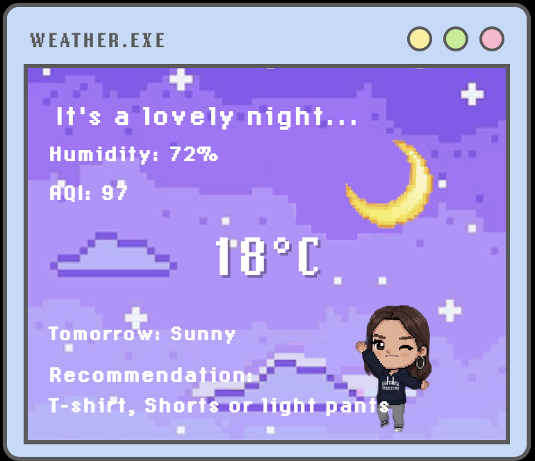

# Weather App

## Quick Start

**Geolocation doesn't work with `file://` URLs!**

Instead of double-clicking the HTML file, run a local server:

```bash
# Option 1: Python (simplest)
python3 -m http.server 8000

# Option 2: Node.js (if you have it)
npx http-server -p 8000
```

Then open: **http://localhost:8000/popup.html**

## Why?

Modern browsers block geolocation on `file://` URLs for security. You need either:
- `http://localhost` (local server)
- `https://` (deployed site)

That's why it stopped working - you probably opened it as a file instead of through a server!

---

## Screenshots

Here is what the Weather App looks like:



---

## API Key Setup

Your weather app requires an API key from [OpenWeatherMap](https://openweathermap.org/api). For security, do **not** commit your API key to public repositories.

**How to add your API key:**

1. Open `popup.js` and find the line:
   ```js
   const API_KEY = "YOUR_API_KEY_HERE";
   ```
   Replace `YOUR_API_KEY_HERE` with your actual API key.

2. Save the file. Your app will now use your key for weather requests.

**Note:**
- Environment variables (like `.env` files or `process.env`) do **not** work in pure browser JavaScript. You must hardcode the key or use extension storage/config files.
- For browser extensions, you can use `chrome.storage` or a config file to store secrets.

## Security Reminder
- Never share your API key publicly.
- If you publish your code, remove or replace your API key before sharing.
